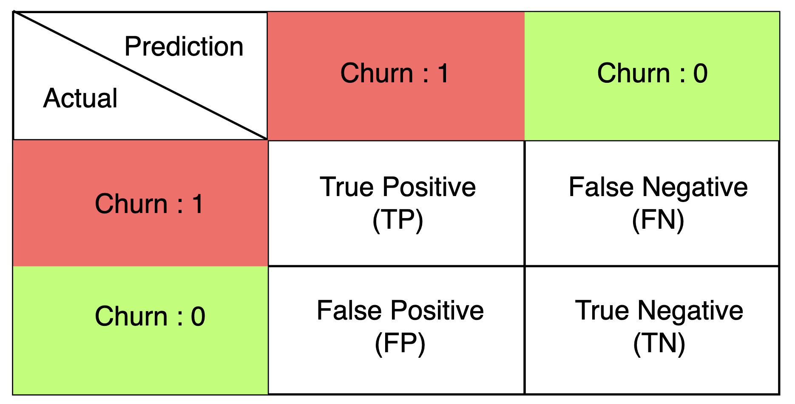
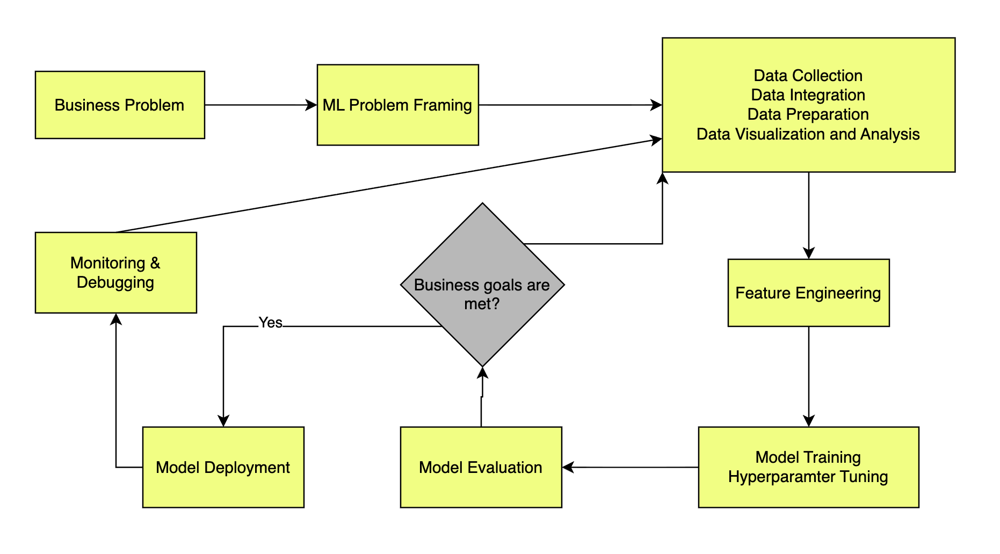

## Addressing Customer Churn with Sagemaker Pipelines

Customer churn is one of the most critical challenges faced by large organizations today. There are lots of problems associated with customer churn. One of the major ones is the impact on revenue. Every customer brings revenue to the company. When customers leave, revenues are directly impacted, and the company must spend heavily to acquire new customers as replacements. Studies show that retaining a customer is nearly five times cheaper than acquiring a new one, making churn prevention a priority for sustainable growth. Beyond financial loss, a high churn rate damages a company’s reputation and signals deeper issues with its products, services, or overall customer experience. Understanding why customers leave is therefore essential. By analyzing churn, organizations can uncover weaknesses in their offerings, design targeted retention strategies for at-risk customers, and optimize marketing efforts to attract new ones more effectively.

### ML Problem Framing

What if we could build a solution that not only predicts which customers are likely to leave but also explains why? This would empower businesses to take proactive action and address the underlying causes of churn.

- This is a binary classification problem. The objective is to predict where a customer is going to leave or stay.
- **Churn = 1** → Customer will leave.
- **Churn = 0** → Customer will stay.

To evaluate such a model, we use the confusion matrix and associated metrics such as precision, recall, and F1 score.

In real world terms, not all prediction outcomes have the same consequences. Some errors cost the company far more than others.
Each category tells us what happened, how the company might respond, and what cost is involved.

1.  True Positive (TP) → Correctly predicted churner.

        Action: Offer retention incentive → customer stays.

        Cost: cost_associated_with_retention_incentive

2.  False Positive (FP) → Predicted churn, but customer would have stayed anyway.

        Action: Incentive wasted.

        Cost: cost_associated_with_retention_incentive

3.  False Negative (FN) → Predicted as staying, but customer actually churns.

        Action: None taken → customer lost.

        Cost: cost_associated_with_churn (very high).

4.  True Negative (TN) → Correctly predicted as staying.

        No cost

It is important to consider the cost associated with the situation.

#### The Simplest Cost Function

Cost = _cost_associated_with_retention_incentive_( TP + FP )  +  _cost_associated_with_churn (FN)_

This will not always hold true in every business context, but given the limited information available, it is reasonable to assume that the cost of churn ≫ cost of retention. Under this assumption, the modeling goal should be to minimize false negatives. In practice, this means preferring a high-recall model that captures as many potential churners as possible, even if it results in more false positives.

### What type of classification model should we choose?

These kinds of classification problems can be tackled using models like logistic regression, random forests, or XGBoost. There are also more complex models out there, but since we need some level of interpretability, it’s important to choose something that’s advanced enough to capture complex patterns while still being understandable when we look at the predictions.

### Operationalizing the Solution

After framing the business problem and understanding the cost dynamics of churn prediction, the next step is figuring out how to operationalize the solution. Machine learning in production is a never-ending process. Models must be continuously monitored, evaluated, and adapted as new data arrives and customer behavior evolves.

Operationalizing the Solution
